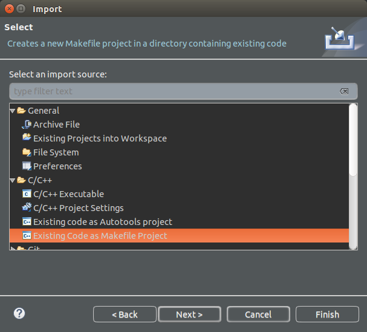
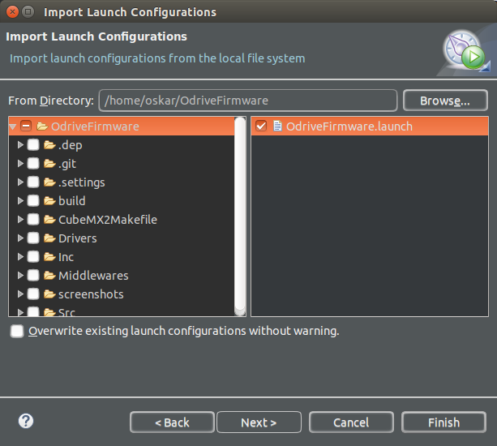
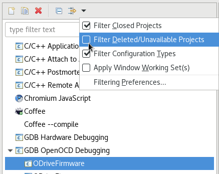

# ODriveFirmware
This project is all about accuratly driving brushless motors, for cheap. The aim is to make it possible to use inexpensive brushless motors in high performance robotics projects.
Like this (click for video):
[](https://www.youtube.com/watch?v=WT4E5nb3KtY)

This repository contains the firmware that runs on the board. The other related repositories are:
* [ODriveHardware](https://github.com/madcowswe/ODriveHardware): Circuit board design. Also, the pinout from the microcontroller to the board is documented [here](https://docs.google.com/spreadsheets/d/1QXDCs1IRtUyG__M_9WruWOheywb-GhOwFtfPcHuN2Fg/edit#gid=404444347).
* [ODrive](https://github.com/madcowswe/ODrive): Configuration and analysis scripts that runs on a PC.

There is also [ODriveFPGA](https://github.com/madcowswe/ODriveFPGA), which contains the FPGA logic and software that runs on the FPGA based ODrive. This is not currently in development, but may be resumed at some later date.

### Table of contents

<!-- MarkdownTOC depth=2 autolink=true bracket=round -->

- [Configuring parameters](#configuring-parameters)
- [Compiling and downloading firmware](#compiling-and-downloading-firmware)
- [Communicating over USB and UART](#communicating-over-usb-and-uart)
- [Generating startup code](#generating-startup-code)
- [Setting up Eclipse development environment](#setting-up-eclipse-development-environment)
- [Notes for Contributors](#notes-for-contributors)

<!-- /MarkdownTOC -->

## Configuring parameters
To correctly operate the ODrive, you need to supply some parameters. Some are mandatory, and if supplied incorrectly will cause the drive to malfunction. To get good performance you must also tune the drive.

### Hardware configuration
The first thing to set is your board hardware version, located at the top of [Inc/main.h](https://github.com/madcowswe/ODriveFirmware/blob/master/Inc/main.h). If, for example, you are using the hardware: ODrive v3.2, then you should set it like this:
```C
#define HW_VERSION_MAJOR 3
#define HW_VERSION_MINOR 2
```

### Communication configuration
If you are using USB only to communicate with the ODrive, you may skip this step.

The GPIO 1,2 pins are configurable as either step/direction, or as UART.
In [MotorControl/commands.c](https://github.com/madcowswe/ODriveFirmware/blob/master/MotorControl/commands.c) please set `gpio_mode` to the corresponding value (`GPIO_MODE_UART` or `GPIO_MODE_STEP_DIR`).


### Motor control parameters
The rest of all the parameters are at the top of the [MotorControl/low_level.c](https://github.com/madcowswe/ODriveFirmware/blob/master/MotorControl/low_level.c) file. Please note that many parameters occur twice, once for each motor.
In it's current state, the motor structs contain both tuning parameters, meant to be set by the developer, and static variables, meant to be modified by the software. Unfortunatly these are mixed together right now, but cleaning this up is a high priority task.

It may be helpful to know that the entry point of each of the motor threads is `void motor_thread` at the bottom of [MotorControl/low_level.c](https://github.com/madcowswe/ODriveFirmware/blob/master/MotorControl/low_level.c). This is like `main` for each motor, and is probably where you should start reading the code.

#### Mandatory parameters
You must set:
* `ENCODER_CPR`: Encoder Count Per Revolution (CPR). This is 4x the Pulse Per Revolution (PPR) value.
* `POLE_PAIRS`: This is the number of magnet poles in the rotor, divided by two. You can simply count the number of magnets in the rotor, if you can see them.
* `brake_resistance`: This is the resistance of the brake resistor. If you are not using it, you may set it to 0.0f.

#### Tuning parameters
The most important parameters are the limits:
* The current limit: `.current_lim = 75.0f, //[A] // Note: consistent with 40v/v gain`. The default current limit, for safety reasons, is set to 10A. This is quite weak, and good for making sure the drive is stable. Once you have tuned the drive, you can increase this to 75A to get some performance. Note that above 75A, you must change the current amplifier gains.
* The velocity limit: `.vel_limit = 20000.0f, // [counts/s]`. Does what it says on the tin.

The motion control gains are currently manually tuned:
* `.pos_gain = 20.0f, // [(counts/s) / counts]`
* `.vel_gain = 15.0f / 10000.0f, // [A/(counts/s)]`
* `.vel_integrator_gain = 10.0f / 10000.0f, // [A/(counts/s * s)]`

An upcoming feature will enable automatic tuning. Until then, here is a rough tuning procedure:
* Set the integrator gain to 0
* Make sure you have a stable system. If it is not, decrease all gains until you have one.
* Increase `vel_gain` by around 30% per iteration until the motor exhibits some vibration.
* Back down `vel_gain` to 50% of the vibrating value.
* Increase `pos_gain` by around 30% per iteration until you see some overshoot.
* Back down `pos_gain` until you do not have overshoot anymore.
* The integrator is not easily tuned, nor is it strictly required. Tune at your own discression.

#### Optional parameters
By default both motors are enabled, and the default control mode is position control.
If you want a different mode, you can change `.control_mode`. To disable a motor, set `.enable_control` and `.do_calibration` to false.

## Compiling and downloading firmware

### Getting a programmer
Get a programmer that supports SWD (Serial Wire Debugging) and is ST-link v2 compatible. You can get them really cheap on [eBay](http://www.ebay.co.uk/itm/ST-Link-V2-Emulator-Downloader-Programming-Mini-Unit-STM8-STM32-with-20CM-Line-/391173940927?hash=item5b13c8a6bf:g:3g8AAOSw~OdVf-Tu) or many other places.

### Installing prerequisites
To compile the program, you first need to install the prerequisite tools:

#### Linux:
* `gcc-arm-none-eabi`: GCC compilation toolchain for ARM microcontrollers.
    * Installing on Ubuntu: `sudo apt-get install gcc-arm-none-eabi`
* `gdb-arm-none-eabi`: GNU project debugger for ARM microcontrollers.
    * Installing on Ubuntu: `sudo apt-get install gdb-arm-none-eabi`
* `OpenOCD`: Open On-Chip Debugging tools. This is what we use to flash the code onto the microcontroller.
    * Installing on Ubuntu: `sudo apt-get install openocd`
* No additional USB CDC driver should be required on Linux.

#### Windows:
Install the following:
* [Git for windows](https://git-scm.com/download/win). This intalls the Git Bash, which is a unix style command line interface that we will be using. 
* [GNU ARM Embedded Toolchain](https://developer.arm.com/open-source/gnu-toolchain/gnu-rm/downloads). The cross-compiler used to compile the code. Download and install the "Windows 32-bit" version. Make sure to tick the "add to path" option.
* [Make for Windows](http://gnuwin32.sourceforge.net/packages/make.htm). Make is used to script the compilation process. Download and run the complete package setup program. Add the path of the binaries to your PATH environment variable. For me this was at `C:\Program Files (x86)\GnuWin32\bin`.
* OpenOCD. Follow the instructions at [GNU ARM Eclipse  - How to install the OpenOCD binaries](http://gnuarmeclipse.github.io/openocd/install/), including the part about ST-LINK/V2 drivers. Add the path of the binaries to your PATH environment variable. For me this was at `C:\Program Files\GNU ARM Eclipse\OpenOCD\0.10.0-201704182147-dev\bin`.

After installing all of the above, open a Git Bash shell. Continue at section [Building the firmware](#building-the-firmware).

### Building the firmware
* Make sure you have cloned the repository.
* Navigate your terminal (bash/cygwin) to the ODriveFirmware dir.
* Run `make` in the root of this repository.

### Flashing the firmware
* **Make sure you have [configured the parameters first](#configuring-parameters)**
* Connect `SWD`, `SWC`, and `GND` on connector J2 to the programmer.
* You need to power the board by only **ONE** of the following: VCC(3.3v), 5V, or the main power connection (the DC bus). The USB port (J1) does not power the board.
* Run `make flash` in the root of this repository.

### Debugging the firmware
Run `make gdb`. This will reset and halt at program start. Now you can set breakpoints and run the program. If you know how to use gdb, you are good to go.
If you prefer to debug from eclipse, see [Setting up Eclipse development environment](#setting-up-eclipse-development-environment).

## Communicating over USB and UART
There is currently a very primitive method to read/write configuration, commands and errors from the ODrive over the USB.
Please use the `ODriveFirmware/tools/test_bulk.py` python script for this.  It is written for Python 3.

Setup instructions as follows:
* Install PyUSB (pip install --pre pysusb)
* Plug in the STLink or another power source to power the ODrive board
* Plug in a separate USB cable into the microUSB connector on ODrive
* On Windows, use the [Zadig](http://zadig.akeo.ie/) utility to set ODrive (not STLink!) driver to libusb
* Run test_bulk.py

### Command set
The most accurate way to understand the commands is to read [the code](https://github.com/madcowswe/ODriveFirmware/blob/master/MotorControl/commands.c#L133) that parses the commands. Nevertheless, here is an overview:

#### UART framing
USB communicates with packets, so it is easy to frame a command as one command per packet. However, UART doesn't have any packeting, so we need a way to frame the commands. The start-of-packet symbol is `$` and the end-of-packet symbol is `!`, that is, something like this: `$command!`. An example of a valid UART position command:
```
$p 0 10000 0 0!
```

#### Motor Position command
```
p motor position velocity_ff current_ff
```
* `p` for position
* `motor` is the motor number, `0` or `1`.
* `position` is the desired position, in encoder counts.
* `velocity_ff` is the velocity feed-forward term, in counts/s.
* `current_ff` is the current feed-forward term, in A.

Note that if you don't know what feed-forward is or what it's used for, simply set it to 0.

#### Motor Velocity command
```
v motor velocity current_ff
```
* `v` for velocity
* `motor` is the motor number, `0` or `1`.
* `velocity` is the desired velocity in counts/s.
* `current_ff` is the current feed-forward term, in A.

Note that if you don't know what feed-forward is or what it's used for, simply set it to 0.

#### Motor Current command
```
c motor current
```
* `c` for current
* `motor` is the motor number, `0` or `1`.
* `current` is the desired current in A.

#### Variable getting and setting
```
g type index
s type index value
```
* `g` for get, `s` for set
* `type` is the data type as follows:
** `0` is float
** `1` is int
** `2` is bool
* `index` is the index in the corresponding [exposed variable table](https://github.com/madcowswe/ODriveFirmware/blob/f19f1b78de4bd917284ff95bc61ca616ca9bacc4/MotorControl/low_level.c#L184-L265).

For example
* `g 0 12` will return the phase resistance of M0
* `s 0 8 10000.0` will set the velocity limit on M0 to 10000 counts/s
* `g 1 3` will return the error status of M0
* `g 1 7` will return the error status of M1

The error status corresponds to the [Error_t enum in low_level.h](https://github.com/madcowswe/ODriveFirmware/blob/f19f1b78de4bd917284ff95bc61ca616ca9bacc4/MotorControl/low_level.h#L17-L35).

Note that the links in this section are to a specific commits to make sure that the line numbers are accurate. That is, they don't link to the newest master, but to an old version. Please check the corresponding lines in the code you are using. This is especially important to get the correct indicies in the exposed variable tables, and the error enum values.

#### Continous monitoring of variables
You can set up variables in monitoring slots, and then have them (or a subset of them) repeatedly printed upon request. Please see the code for this.

## Generating startup code
**Note:** You do not need to run this step to program the board. This is only required if you wish to update the auto generated code.

This project uses the STM32CubeMX tool to generate startup code and to ease the configuration of the peripherals.
We also use a tool to generate the Makefile. The steps to do this are as follows.

### Installing prerequisites
* `stm32cubeMX`: Tool from STM to automatically generate setup routines and configure libraries, etc.
    * Available [here](http://www2.st.com/content/st_com/en/products/development-tools/software-development-tools/stm32-software-development-tools/stm32-configurators-and-code-generators/stm32cubemx.html?icmp=stm32cubemx_pron_pr-stm32cubef2_apr2014&sc=stm32cube-pr2)

### Generate code
* Run stm32cubeMX and load the `stm32cubemx/Odrive.ioc` project file.
* Press `Project -> Generate code`
* You may need to let it download some drivers and such.

## Setting up Eclipse development environment

### Install
* Install [Eclipse IDE for C/C++ Developers](http://www.eclipse.org/downloads/packages/eclipse-ide-cc-developers/neon3)
* Install the [OpenOCD Eclipse plugin](http://gnuarmeclipse.github.io/plugins/install/)

### Import project
* File -> Import -> C/C++ -> Existing Code as Makefile Project
* Browse for existing code location, find the OdriveFirmware root.
* In the Toolchain options, select `Cross GCC`
* Hit Finish
* Build the project (press ctrl-B)



### Load the launch configuration
* File -> Import -> Run/Debug -> Launch Configurations -> Next
* Highlight (don't tick) the OdriveFirmare folder in the left column
* Tick OdriveFirmware.launch in the right column
* Hit Finish



### Launch!
* Make sure the programmer is connected to the board as per [Flashing the firmware](#flashing-the-firmware).
* Press the down-arrow of the debug symbol in the toolbar, and hit Debug Configurations
    * You can also hit Run -> Debug Configurations
* Highlight the debug configuration you imported, called OdriveFirmware. If you do not see the imported launch configuration rename your project to `ODriveFirmware` or edit the launch configuration to match your project name by unfiltering unavailable projects:



* Hit Debug
* Eclipse should flash the board for you and the program should start halted on the first instruction in `Main`
* Set beakpoints, step, hit Resume, etc.
* Make some cool features! ;D

## Notes for Contributors
In general the project uses the [Google C++ Style Guide](https://google.github.io/styleguide/cppguide.html), except that the default indendtation is 4 spaces, and that the 80 character limit is not very strictly enforced, merely encouraged.

### Code maintenance notes
The cortex M4F processor has hardware single precision float unit. However double precision operations are not accelerated, and hence should be avoided. The following regex is helpful for cleaning out double constants:
find: `([-+]?[0-9]+\.[0-9]+(?:[eE][-+]?[0-9]+)?)([^f0-9e])`
replace: `\1f\2`
