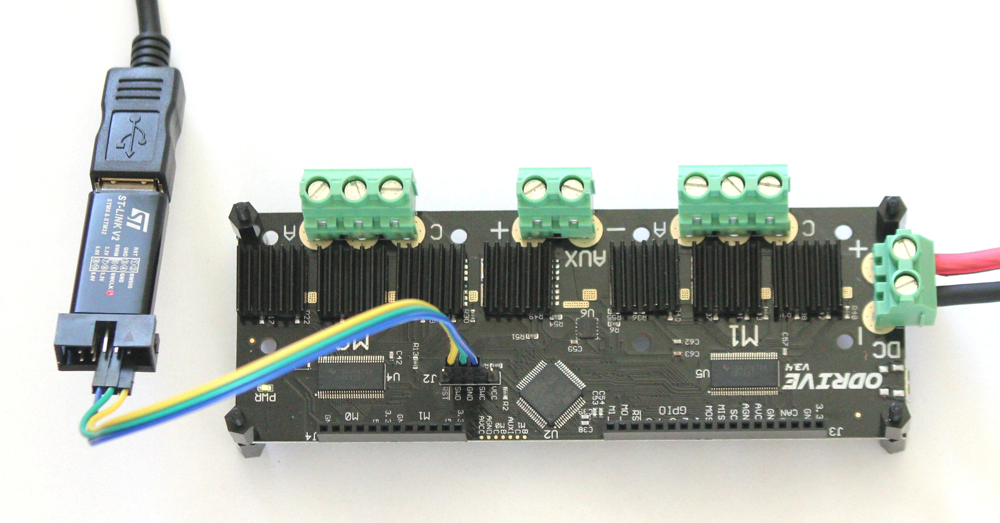

# ODrive Tool

The ODrive Tool is the accompanying PC program for the ODrive. It's main purpose is to provide an interactive shell to control the device manually, as well as some supporting functions like firmware update.

## Installation

Refer to the [Getting Started guide](getting-started#downloading-and-installing-tools).

Type `odrivetool --help` to see what features are available.

## Multiple ODrives

By default, `odrivetool` will connect to any ODrive it finds. If this is not what you want, you can select a specific ODrive.

To find the serial number of your ODrive, run `odrivetool`, connect exactly one ODrive and power it up. You should see this:
```
Connected to ODrive 306A396A3235 as odrv0
In [1]: 
```
`306A396A3235` is the serial number of this particular ODrive. If you want ODrive Tool to ignore all other devices you would close it and then run `odrivetool --serial-number 306A396A3235`.

<details><summary markdown="span">My ODrive is stuck in DFU mode, can I still find the serial number?</summary><div markdown="block">
Yes, the serial number is part of the USB descriptors.

In Linux you can find it by running:
```
$ (sudo lsusb -d 1209:0d32 -v; sudo lsusb -d 0483:df11 -v) 2>/dev/null | grep iSerial
  iSerial                 3 385F324D3037
  iSerial                 3 306A396A3235
```
Here, two ODrives are connected.
</div></details>

## Device Firmware Update

<div class="note" markdown="span">__ODrive v3.3, v3.4__: You need to flash with the external programmer first (see [below](#flashing-with-an-stlink)), before you can reflash in DFU mode.</div>

1. Download the latest firmware release form [here](https://github.com/madcowswe/ODrive/releases). You will need the __.hex__ file. Make sure you select the file that matches your board version.
2. Open up a terminal and navigate to the directory where the firmware is.
3. Run the following command (replace `ODriveFirmware_v3.4-24V.hex` with the name of your firmware file):
```
~/Downloads $ odrivetool dfu ODriveFirmware_v3.4-24V.hex 
ODrive control utility v0.3.7.dev-11
Waiting for ODrive...
Putting device 306A396A3235 into DFU mode...
Found device 306A396A3235 in DFU mode
Erasing... done            
Flashing... done            
Verifying... done            
```

### Troubleshooting

* __Windows__: During the update, a new device called "STM32 BOOTLOADER" will appear. Open the [Zadig utility](http://zadig.akeo.ie/) and set the driver for "STM32 BOOTLOADER" to libusb-win32. After that the firmware update will continue.
* On some machines you will need to unplug and plug back in the USB cable to make the PC understand that we switched from regular mode to bootloader mode.
* Currently a firmware update will preserve the configuration if and only if the parameters of both firmware versions are identical. This will change in the future.
* If the DFU script can't find the device, try forcing it into DFU mode.

  <details><summary markdown="span">How to force DFU mode (ODrive v3.5)</summary><div markdown="block">
  Flick the DIP switch that "DFU, RUN" to "DFU" and power cycle the board. If that alone doesn't work, also connect the  After you're done, put the switch back into the "RUN" position and power cycle the board again.
  </div></details>

  <details><summary markdown="span">How to force DFU mode (ODrive v3.1, v3.2)</summary><div markdown="block">
  Connect the pin "BOOT0" to "3.3V" and power cycle the board. If that alone doesn't work, also connect the pin "GPIO1" to "GND". After you're done, remove the wires and power cycle the board again.
  </div></details>


## Flashing with an STLink

This procedure is only necessary for ODrive v3.4. You will need an STLink/v2 or compatible programmer. You should have received one with your ODrive.

1. Install OpenOCD
   * **Windows:** [instructions](http://gnuarmeclipse.github.io/openocd/install/) (also follow the instructions on the ST-LINK/V2 drivers)
   * **Linux:** `sudo apt-get install openocd`
   * **macOS:** `brew install openocd`
2. Download the latest firmware release form [here](https://github.com/madcowswe/ODrive/releases). You will need the __.elf__ file. Make sure you select the file that matches your board version.
3. Wire up the ODrive and STLink/v2 programmer as shown in this picture:<br>
     
     Power up the ODrive.
4. Open up a terminal and navigate to the directory where the firmware is.
5. Run the following command (replace `ODriveFirmware_v3.4-24V.elf` with the name of your firmware file):
  ```
~/Downloads $ openocd -f interface/stlink-v2.cfg -f target/stm32f4x.cfg -c init -c reset\ halt -c flash\ write_image\ erase\ ODriveFirmware_v3.4-24V.elf -c reset\ run -c exit
Open On-Chip Debugger 0.10.0
Licensed under GNU GPL v2
For bug reports, read
	http://openocd.org/doc/doxygen/bugs.html
Info : auto-selecting first available session transport "hla_swd". To override use 'transport select <transport>'.
Info : The selected transport took over low-level target control. The results might differ compared to plain JTAG/SWD
adapter speed: 2000 kHz
adapter_nsrst_delay: 100
none separate
Info : Unable to match requested speed 2000 kHz, using 1800 kHz
Info : Unable to match requested speed 2000 kHz, using 1800 kHz
Info : clock speed 1800 kHz
Info : STLINK v2 JTAG v17 API v2 SWIM v4 VID 0x0483 PID 0x3748
Info : using stlink api v2
Info : Target voltage: 3.236027
Info : stm32f4x.cpu: hardware has 6 breakpoints, 4 watchpoints
adapter speed: 2000 kHz
target halted due to debug-request, current mode: Thread 
xPSR: 0x01000000 pc: 0x08009224 msp: 0x20020000
auto erase enabled
Info : device id = 0x10076413
Info : flash size = 1024kbytes
target halted due to breakpoint, current mode: Thread 
xPSR: 0x61000000 pc: 0x20000046 msp: 0x20020000
Warn : no flash bank found for address 10000000
wrote 262144 bytes from file ODriveFirmware_v3.4-24V.elf in 10.194110s (25.113 KiB/s)
adapter speed: 2000 kHz
  ```

From now on you can use the device with the DFU feature. If you modify the firmware in a way that prevents it from communicating, you may have to repeat this procedure.

If something doesn't work, make sure `openocd` is in your `PATH` variable, check that the wires are connected properly and try with elevated privileges.
